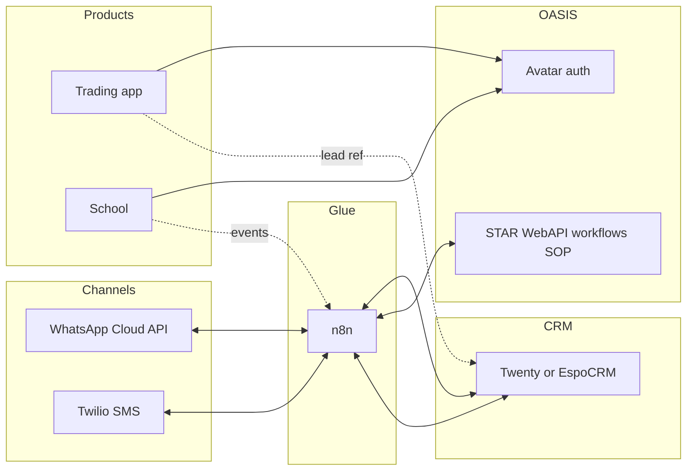

# AntiTrader — CRM & integration design plan

> **Purpose:** A simple CRM with a leads funnel, WhatsApp and SMS, a single view of potential customers, and integration with the broader OASIS stack (workflows / SOP / STAR), plus the team’s **trading app** and **school** — built primarily from **off-the-shelf** components.

---

## 1. Goals

| Goal | Description |
|------|-------------|
| **Single system of record** | Contacts/leads, pipeline stage, owner, tags, activity history |
| **Channels** | Inbound/outbound **WhatsApp** and **SMS**, logged against the correct lead |
| **Funnel** | Stages from first touch through qualification, enrollment, and conversion |
| **Stack integration** | Stable IDs and events to **OASIS** (Avatar, workflows, SOP/holons) and to **trading** + **school** apps |
| **Cost model** | Prefer **self-hosted OSS** for CRM glue; accept **usage-based** fees for WhatsApp/SMS providers |

---

## 2. Off-the-shelf component stack

| Layer | Component | Role |
|--------|-----------|------|
| **CRM + funnel** | **[Twenty](https://www.twenty.com/)** *or* **[EspoCRM](https://www.espocrm.com/)** (self-hosted) | Leads, pipeline, contacts, tasks; REST API and webhooks |
| **Integration bus** | **[n8n](https://n8n.io/)** (self-hosted) | Connect CRM ↔ OASIS ↔ messaging without a large custom integration service |
| **WhatsApp** | **Meta WhatsApp Cloud API** | Official API; aligns with existing Union-style integrations |
| **SMS** | **Twilio** (alternatives: Vonage, MessageBird) | SMS in/out; per-message + number costs |
| **Unified inbox (optional)** | **[Chatwoot](https://www.chatwoot.com/)** | Single UI for WhatsApp + SMS + later email; Meta + Twilio remain the providers behind it |
| **Identity** | **OASIS Avatar / JWT** | Same person across trading, school, CRM-driven workflows |

**CRM choice**

- **Twenty:** Modern stack (NestJS, Postgres), Docker-friendly, API-first — good when the team wants minimal custom CRM UI.
- **EspoCRM:** Broader classic CRM surface (campaigns, cases, etc.) — good when you want more features before writing code.

Pick **one** CRM as the pipeline source of truth.

---

## 3. Architecture

**Principles**

- The **CRM** holds **pipeline state** and **contact facts**.
- **n8n** handles **routing, mapping, and light transforms** — not long-term business logic that must be audited.
- **STAR / workflows / SOP** hold **governed process**, evidence, and cross-system rules where **auditability** matters.
- **Trading** and **school** store **foreign keys** (`crmContactId`, `leadId`, `avatarId`) — they do not each become a separate CRM.

---

## 4. Integration contracts

| Field | Use |
|--------|-----|
| `avatarId` | Canonical OASIS identity (UUID) |
| `crmContactId` / `leadId` | Canonical row in the chosen CRM |
| `phoneE164` | Match key for WhatsApp and SMS deduplication |
| **Events** (examples) | `lead.created`, `lead.stage_changed`, `message.inbound`, `message.outbound`, `sop.completed`, `school.enrolled`, `trading.kyc_passed` |

Webhook handlers should be **idempotent** (providers retry deliveries).

---

## 5. Phased delivery

### Phase A — Foundation

- Deploy CRM (Docker), Postgres, backups, basic admin access.
- Define pipeline stages (e.g. New → Qualified → Call booked → Enrolled / KYC → Won / Lost).
- Add custom fields as needed: `source`, `schoolProgram`, `tradingTier`, `avatarId`, `phoneE164`.
- Deploy **n8n**; store secrets for CRM API, OASIS, Twilio, Meta.

### Phase B — WhatsApp

- Wire **Meta webhooks** → n8n → find-or-create lead by phone → append activity.
- Outbound: from CRM triggers or n8n, call Meta API (respect **24h session** vs **templates**).

### Phase C — SMS

- Twilio number + inbound webhook → n8n → same lead matching and logging.
- Outbound SMS from approved flows; document **opt-in / compliance** for your regions.

### Phase D — OASIS / STAR

- **CRM → OASIS:** stage change → n8n → `POST` workflow execute / SOP trigger as appropriate.
- **OASIS → CRM:** SOP or workflow completion → n8n → update CRM stage or tags via API.

### Phase E — Trading app & school

- **Trading:** Signup/KYC milestones call an internal API or webhook → CRM update; persist `crmContactId` on the trading profile.
- **School:** Enrollment/completion events → n8n → CRM stage + optional STAR workflow.
- Ops uses the **CRM** for a **single customer timeline**; product apps stay thin.

### Phase F — Hardening

- Monitoring, alerting, secret rotation, retention policy for messages and PII.
- Load/chaos testing on webhook paths.

---

## 6. Optional: Chatwoot

Add **Chatwoot** when the team needs a **shared inbox UI** for many agents. It sits **above** Meta + Twilio; it is **not** required for an MVP if n8n + CRM notes are enough.

---

## 7. Cost expectations

| Item | Notes |
|------|--------|
| Self-hosted **Twenty / Espo / n8n** | No license fee to the projects; **hosting + ops time** apply |
| **WhatsApp** | Meta **conversation-based** pricing |
| **SMS** | **Per message** + phone number rental |
| **Chatwoot** | OSS self-hosted: infra only |

---

## 8. Early decisions to lock

1. **Twenty vs EspoCRM**
2. **Chatwoot in MVP or phase 2**
3. **Which system owns pipeline truth for regulated steps** — recommendation: **CRM owns funnel stages**; **OASIS owns proof and SOP completion**

---

## 9. Related OASIS repo context

- **SOP / holonic workflows:** `SOP/README.md`, `SOP/BUILD_PLAN.md`, STAR workflow APIs.
- **WhatsApp admin pattern:** `The Union/union-messaging` + `union-api` (Meta Cloud API, persisted threads) — reuse patterns, not necessarily the same datastore as the new CRM.

---

---

## 10. Implementation status (repo)

| Item | Status |
|------|--------|
| `docker-compose.yml` — Twenty + Postgres + Redis + worker, n8n, **antitrader-bridge** | ✅ |
| `bridge/` — Meta + Twilio signature verification, JSON forward to n8n | ✅ |
| `integrations/EVENT_CONTRACT.md` — envelope shape for n8n | ✅ |
| `README.md` — runbook | ✅ |
| Bridge `normalized` fields (phone, text, ids) for n8n | ✅ |
| `integrations/TWENTY_API.md`, `integrations/n8n/WORKFLOW_STEPS.md` | ✅ |
| n8n starter workflow `integrations/n8n/antitrader-inbound-to-twenty.json` + **IMPORT.md** | ✅ |
| Set `TWENTY_API_KEY` + `N8N_FORWARD_WEBHOOK_URL=http://n8n:5678/webhook/antitrader-inbound` | ⏳ You configure |
| Twenty pipeline/fields doc `integrations/TWENTY_PIPELINE.md` | ✅ |
| CRM stage / completion → STAR (`POST /api/workflow/execute`) | ⏳ Next |

See **`README.md`** for ports and environment variables.

---

*Document version: 1.1 — aligns off-the-shelf CRM + messaging with OASIS as integration and process layer.*
