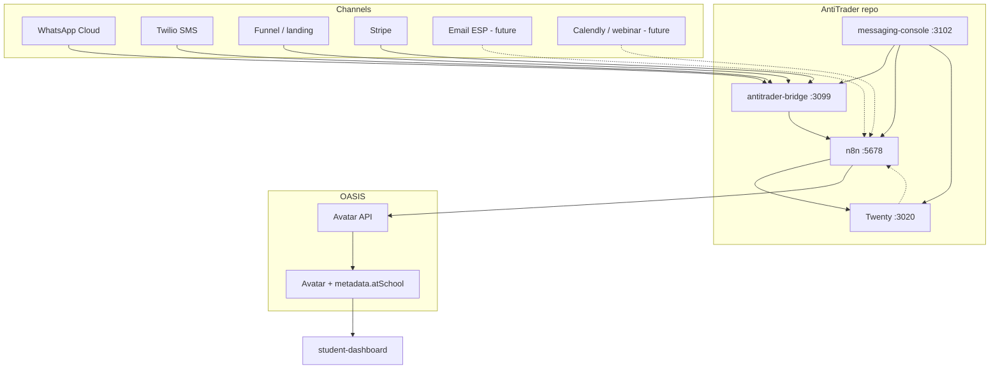

# AntiTrader — gap analysis & build blueprint

**Purpose:** Map what exists in-repo today against the target system: **full sales CRM**, **cross-channel messaging + campaign pipeline**, and **student-dashboard** as a **gamified, live** view of program progress — with **OASIS Avatar** as the identity spine. Use this document to sequence engineering work; it is the handoff spec for the next build phase.

**Related:** `DESIGN_PLAN.md`, `integrations/EVENT_CONTRACT.md`, `integrations/TWENTY_PIPELINE.md`, `docs/MESSAGING_STACK.md`, `integrations/FUNNEL_P0.md`.

**Implementation status (Phase 0–2):** Inbound, funnel, and **Stripe** n8n workflows use **GET** by primary phone or email, **PATCH** `jobTitle` (append, capped) when a Person exists, else **POST** create. Stripe **`checkout.session.completed`** also skips duplicate webhook deliveries when **`jobTitle`** already logs that **session id**. **Outbound:** Twilio SMS (**`antitrader-send-sms`**) and WhatsApp **template** sends (**`antitrader-send-whatsapp`**) use **`N8N_ANTITRADER_OUTBOUND_SECRET`** on n8n; **`messaging-console`** exposes **`/api/send-sms`** and **`/api/send-whatsapp`** (secrets server-side only) — see **`integrations/EVENT_CONTRACT.md`** §4–§5.

---

## 1. North-star (what “done” means)

| Pillar | Must deliver |
|--------|----------------|
| **Sales CRM** | Single system of record: People, Opportunities, pipeline stages, owner, tasks/notes, **deduplicated** identity (phone + email). |
| **Messaging** | **Inbound + outbound** WhatsApp & SMS (and later **email**) with **verified** webhooks, **idempotent** handling, **auditable** history tied to the **same contact**. |
| **Campaigns** | **Attribution** (UTM/funnel), **segments** (at least CRM-filter driven), **scheduled / triggered** sends, **template** discipline (esp. WhatsApp 24h vs HSM). |
| **Student experience** | **student-dashboard** shows **live** progress (modules, streak, tiers) **and** can surface **notable** cross-system events (e.g. enrollment, key coach messages) via **`metadata.atSchool`** or a dedicated API. |
| **Identity** | **`avatarId`** (OASIS), **`crmContactId`** (Twenty person id), **`phoneE164`** aligned everywhere — no shadow CRMs in product apps. |

---

## 2. Reference architecture

**Invariant:** Every automation that touches a person should be able to resolve **at least one** of: `crmContactId`, `avatarId`, `phoneE164`, `primaryEmail` — and **converge** duplicates explicitly (no silent double-create without a rule).

---

## 3. Capability matrix (today vs needed)

Legend: **Have** = shipped & usable · **Partial** = exists but incomplete for production · **Missing** = not in repo or not wired end-to-end.

| Capability | Status | Notes |
|------------|--------|--------|
| Twenty CRM (Docker) | **Have** | Pipeline, People, Opportunities |
| Demo CRM data (trading-school narrative) | **Have** | `scripts/seed-antitrader-twenty-demo.mjs` |
| Custom CRM fields (`avatarId`, program, etc.) | **Partial** | Documented in `TWENTY_PIPELINE.md`; must match **your** Twenty REST playground |
| Bridge: Meta WhatsApp verify + forward | **Have** | `bridge/server.mjs` |
| Bridge: Twilio SMS verify + forward | **Have** | |
| Bridge: Funnel static + POST | **Have** | `public-funnel/`, `N8N_FUNNEL_WEBHOOK_URL` |
| Bridge: Stripe verify + forward | **Have** | Needs `STRIPE_*` in prod |
| n8n: inbound → Twenty create | **Have** | `antitrader-inbound-to-twenty.json` |
| n8n: funnel → Twenty | **Have** | `antitrader-funnel-to-twenty.json` |
| n8n: Stripe checkout → Twenty | **Have** | `antitrader-stripe-to-twenty.json` |
| n8n: sales-journey webhook | **Have** | find/update/create Person |
| Find-or-create **dedupe** (phone/email) | **Have** (core paths) | **Inbound, funnel, Stripe, sales-journey:** GET+PATCH/POST; Stripe retries idempotent via **session id** in `jobTitle` |
| **Outbound** WhatsApp/SMS from operators | **Missing** | No unified send API in AntiTrader; must use Meta/Twilio from n8n or new service |
| **Email** channel (transactional + marketing) | **Missing** | Not on bridge; add ESP + n8n or bridge route |
| **Campaign** segments + scheduling UI | **Missing** | n8n can schedule; no AntiTrader campaign UI |
| **Message archive** (Union-style single store) | **Missing** | Relies on Twenty notes + n8n logs; no `messages.json` equivalent |
| **messaging-console**: operator home | **Partial** | Health + links; **no** compose/inbox |
| **student-dashboard**: OASIS JWT + HUD | **Have** | `student-dashboard.html` |
| **student-dashboard**: `metadata.atSchool` | **Partial** | `mapStudentFromOasis`; activity often **default/mock** |
| **CRM ↔ Avatar** sync on enroll | **Missing** | Contract in `DESIGN_PLAN.md`; **no** automated PATCH to `atSchool` in repo |
| STAR / SOP triggers | **Partial** | Documented; depends on deployed OASIS STAR endpoints |
| Compliance (opt-in, retention) | **Partial** | Ops docs; **no** automated policy engine |

---

## 4. Gap deep-dives & build implications

### 4.1 Identity (`avatarId`, `crmContactId`, `phoneE164`, email)

**Gap:** Workflows create People without always **linking** to an existing Avatar or **merging** duplicates.

**Build:**

1. Twenty: add **custom fields** (or use `jobTitle` / notes only as interim — already stressed in docs) for **`avatarId`**, **`source`**, optional program/tier — **keys from REST playground only**.
2. n8n: standardize **one** “resolve contact” subflow: **GET** `/rest/people?filter=…` by email, then phone, then **POST** if absent.
3. When OASIS JWT or internal API provides **`avatarId`**, **PATCH** Twenty Person and store **`crmContactId`** back on Avatar metadata (direction: implement **one** canonical n8n workflow or OASIS hook).

**Acceptance:** Same real person never gets **two** Twenty rows from SMS + funnel without a **merge** rule or manual exception queue.

---

### 4.2 CRM (Twenty)

**Have:** Pipeline stages (enum), opportunities, seed script.

**Gap:** Production **pipeline** may differ from seed; **activities** as full “timeline” may require **Notes/Tasks** API usage beyond Person create.

**Build:**

1. Align **stage names** in Twenty UI with `TWENTY_PIPELINE.md` + sales story.
2. n8n: on key events, **create Note or Task** (Twenty REST per playground) so ops sees history **inside CRM**, not only `jobTitle` lines.
3. **Owner / assignee** on opportunities — set from webhook payload (`journeyStage`, rep id) when you have rep identity.

**Acceptance:** A rep can open Twenty and see **why** stage changed and **which** automation touched the record.

---

### 4.3 Ingress (bridge)

**Have:** Verified Meta, Twilio, funnel, Stripe.

**Gap:** **Email** webhooks (SendGrid/Mailgun inbound) not on bridge; **no** generic “signed webhook” router except Stripe pattern.

**Build (optional):** Add **`POST /webhooks/email/inbound`** with provider signature verification **or** send email events **directly to n8n** (like Calendly) per `EVENT_CONTRACT.md`.

**Acceptance:** Inbound email creates/updates Person and thread reference same as SMS.

---

### 4.4 n8n (automation bus)

**Have:** Multiple workflows; import script with stdin fix; `TWENTY_*` env.

**Gap:** **Outbound** sends (template SMS, WhatsApp template messages) as **reusable** workflows; **error alerting** when Twenty POST fails.

**Build:**

1. Workflow: **`send-sms`** — HTTP to Twilio with **idempotency key** in body or Twilio metadata.
2. Workflow: **`send-whatsapp-template`** — Meta Cloud API with **template name** + params; respect **24h session** vs template.
3. **Dead-letter:** failed execution → Slack/email (n8n Error Workflow or external).

**Acceptance:** Operators can trigger a test send **only** to known test numbers without touching production segments.

---

### 4.5 Campaign pipeline (marketing)

**Have:** Funnel + UTM → n8n; Stripe paid signal; **sales-journey** webhook for external tools.

**Gap:** **Audience definition** (SQL-like “stage = X and tag = Y”), **frequency caps**, **A/B**, **unsubscribe** for email/SMS.

**Build (phased):**

1. **MVP:** CRM **filters** exported as CSV → manual send (not ideal but honest).
2. **V1:** n8n **scheduled** workflow: **GET** people filter from Twenty → loop **send** with rate limit.
3. **V2:** Thin **`AntiTrader/campaigns-api`** or **reuse Chatwoot**/ESP campaign features — only if n8n loops become unmanageable.

**Acceptance:** Any broadcast is **attributed** (campaign id in payload) and **logged** in CRM or message store.

---

### 4.6 Student dashboard (`student-dashboard/`)

**Have:** Skybox HUD, OASIS auth, **`mapStudentFromOasis`**, `metadata.atSchool` for modules/streak/**activity** array.

**Gap:** **No** live link to **CRM** or **messaging**; activity feed is partly **placeholder**; **enrollment** does not automatically enrich `atSchool`.

**Build:**

1. **OASIS:** On **enrolled / Won** in CRM, n8n calls OASIS API to **merge** `metadata.atSchool` (program start, tier, welcome flag).
2. **Dashboard:** Add optional **`?messagingFeed=1`** or fetch **`GET /api/student/activity`** (future) that merges:
   - LMS events (from `atSchool.activity`),
   - **high-level** comms events (e.g. “Coach message — WhatsApp” **without** full body if privacy requires).
3. **Polling vs push:** Start with **poll on interval** after JWT load; WebSocket later if OASIS supports it.

**Acceptance:** After test enrollment, student sees **real** milestone in activity feed without editing HTML mocks.

---

### 4.7 messaging-console (`messaging-console/`)

**Have:** Next app, bridge health proxy, links.

**Gap:** **Inbox**, **compose**, **thread**, **broadcast** — parity with union-messaging **conceptually** without copying The Union repo blindly.

**Build (ordered):**

1. **Read-only:** Embed or link **Twenty person URL** + **last n8n execution** links (by workflow id).
2. **Compose:** **Done (SMS + WhatsApp template)** — `messaging-console` **`POST /api/send-sms`** and **`POST /api/send-whatsapp`** forward to n8n with **server-only** secret. Optional **`MESSAGING_CONSOLE_OPERATOR_PASSWORD`**. **Threads** still need a message store (Twenty Notes or dedicated DB).
3. **Threads:** Requires **message store** — either Twenty Notes API, **new** `antitrader-messaging-store` (SQLite/Postgres), or **Chatwoot**.

**Acceptance:** Operator never sends from a **disconnected** UI — every send goes through **n8n** or **bridge** with **EVENT_CONTRACT** envelope.

---

### 4.8 STAR / audit / compliance

**Gap:** Not enforced in code paths in this repo alone.

**Build:** Wire **stage change** → n8n → STAR `workflow/execute` when JWT and base URL are production-ready; document **retention** for message bodies in bridge logs vs Twenty.

---

## 5. Phased implementation plan (recommended order)

Use this as the **sprint backlog**; each phase has **exit criteria** you can demo.

### Phase 0 — Freeze contracts (1–2 days)

- Freeze **`EVENT_CONTRACT.md`** `source` values for outbound: `message_outbound`, `campaign_send`.
- Document **Twenty** field keys from playground in `integrations/TWENTY_API.md` appendix.

**Exit:** New engineer can implement a webhook without guessing JSON shapes.

---

### Phase 1 — Identity & dedupe (highest leverage)

- Implement **shared n8n subflow** or **Code node include pattern**: resolve Person by email → phone → create.
- Update **inbound** and **funnel** workflows to use it.
- Add **Twenty** custom field **`avatarId`** when available from OASIS.

**Exit:** Smoke test: same phone via SMS + funnel email **merges** to one Person.

---

### Phase 2 — Outbound v1

- n8n workflows **`send-twilio-sms`**, **`send-whatsapp-template`** (parameters: `to`, `template`, `crmContactId`, `avatarId`).
- Secrets: Twilio + Meta tokens in n8n credentials or env (already pattern for Twenty).

**Exit:** From n8n manual execution, message reaches test device and **logs** to CRM note or external log.

---

### Phase 3 — Enrollment → OASIS `atSchool`

- On Stripe **checkout.session.completed** or Opportunity **stage = Enrolled**, n8n **HTTP** to OASIS **update avatar metadata** (exact endpoint per OASIS deployment).
- **student-dashboard:** remove reliance on **defaultActivity()** when `atSchool.activity` is populated.

**Exit:** New paying student opens dashboard and sees **enrollment event** in feed from **real** metadata.

---

### Phase 4 — messaging-console v2

- **Compose** page calling n8n webhooks with **CSRF** + **role** check (even basic **shared secret** + IP allowlist first).
- **Optional:** Chatwoot embed or iframe if you adopt it (`DESIGN_PLAN.md` optional section).

**Exit:** Operator sends SMS/WhatsApp from **AntiTrader-themed** UI without opening Twilio/Meta consoles.

---

### Phase 5 — Email + campaigns

- Add **ESP** (e.g. SendGrid) inbound parse → n8n **or** bridge route.
- **Scheduled** segment sends via n8n + **unsubscribe** link handling.

**Exit:** One **email campaign** with CRM segment and **audit** trail.

---

### Phase 6 — Hardening

- Monitoring (healthchecks for bridge, n8n, Twenty).
- PII retention policy; log redaction in bridge.

**Exit:** Runbook for incident + key rotation.

---

## 6. File & component map (where work lands)

| Concern | Primary locations |
|---------|-------------------|
| Ingress | `bridge/server.mjs`, `bridge/normalize.mjs`, `.env.example` |
| CRM | Twenty (external), `scripts/seed-antitrader-twenty-demo.mjs` |
| Workflows | `integrations/n8n/*.json`, `scripts/import-n8n-workflow.sh` |
| Contracts | `integrations/EVENT_CONTRACT.md` |
| Operator UI | `messaging-console/app/**` |
| Student UI | `student-dashboard/student-dashboard.html` |
| Docs | `docs/GAP_ANALYSIS.md` (this file), `docs/MESSAGING_STACK.md`, `DESIGN_PLAN.md` |

---

## 7. Environment & webhook inventory (checklist)

| Variable / route | Role |
|------------------|------|
| `N8N_FORWARD_WEBHOOK_URL` | Meta + Twilio → inbound workflow |
| `N8N_FUNNEL_WEBHOOK_URL` | Funnel submit |
| `N8N_STRIPE_WEBHOOK_URL` | Stripe events |
| `STRIPE_API_KEY`, `STRIPE_WEBHOOK_SECRET` | Stripe verify |
| `META_*`, `TWILIO_*` | Channel verify |
| `TWENTY_INTERNAL_BASE`, `TWENTY_API_KEY` | n8n → Twenty |
| n8n `/webhook/sales-journey` | Calendly-style JSON |
| OASIS API URL + JWT | Avatar updates from n8n |

---

## 8. Risks & mitigations

| Risk | Mitigation |
|------|------------|
| Duplicate People | Phase 1 dedupe; **merge** UI in Twenty or n8n exception branch |
| WhatsApp template rejection | Template library in Notion + Meta Business review cycle |
| OASIS API drift | Version the **HTTP Request** nodes; integration tests against staging OASIS |
| Student PII in feeds | **Summaries** in activity feed; full message bodies only in CRM or secure inbox |

---

## 9. Definition of “MVP shipped”

1. **Sales:** Lead can enter via funnel **or** SMS/WhatsApp; **one** Person; pipeline moves through **documented** stages.  
2. **Pay:** Stripe marks **paid**; CRM updates; **optional** OASIS `atSchool` bump.  
3. **Student:** Dashboard shows **real** progress fields from OASIS, not only mocks.  
4. **Ops:** Someone can **send** one outbound SMS/WA from **n8n** (Phase 2) and **messaging-console** (Phase 4) without raw curl.

Anything beyond that is **scale & comfort** (email campaigns, Chatwoot, full analytics).

---

*Last updated: aligned with AntiTrader repo layout; revise when new workflows or services land.*
